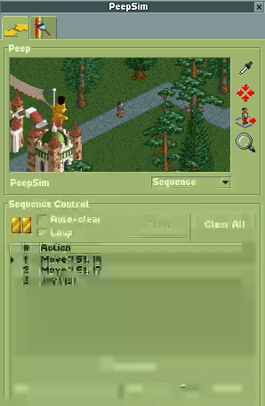
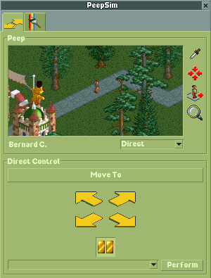
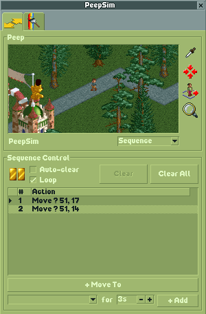
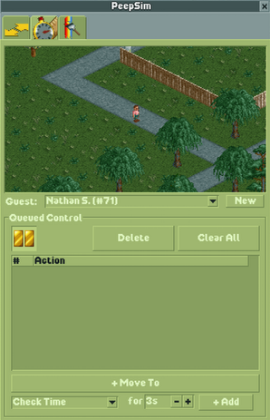

# PeepSim - OpenRCT2 Plugin

A guest control plugin for OpenRCT2. Select or spawn guests, move them around the park, sequence action routines, dress them up, and persist everything into the park file!



## Features

### Multi-Guest Control

Each guest can be in one of three modes:

- **Uncontrolled** - guest walks freely under normal AI control
- **Direct Control** - manual movement and animation, guest idles when not given input
- **Sequence Control** - build and play back sequences of moves and timed animations

You can manage multiple controlled guests at the same time.

### Peep Panel

Both tabs share a panel at the top with:

- A live viewport following the selected guest
- Eyedropper tool to pick a guest from the park
- Locate button to scroll the main viewport to the guest
- Spawn button to create a new guest in direct control mode
- Search button to open a popup to view and select your controlled guests
- Guest name label and mode dropdown

### Direct Control



- **Move To** - click a tile on the map to walk the guest there
- **Directional arrows** - walk NE/SE/SW/NW continuously
- **Idle toggle** - freeze or unfreeze the guest in place
- **Action dropdown** - pick an animation and perform it

### Sequence Control



- Build a sequence of move and animation steps that play one after another
- Play/pause with a status marker in the list
- Optional auto-clear to remove steps after they finish
- Optional loop to restart the sequence from the beginning
- Add moves with "+ Move To" or timed animations with "+ Add"
- Delete individual steps or clear the whole sequence

### Appearance



- Shirt and pants colour pickers
- Accessory dropdown: None, Hat, Sunglasses, Balloon, or Umbrella
- Colour picker for hat, balloon, and umbrella

### Save and Load

All guest modes and sequences are saved into the park file automatically. State is saved on park save and window close, and restored when the window opens or a park is loaded.

## Installation

### From a release

Download `openrct2-plugin-peepsim.js` from the [Releases](../../releases) page and drop it into your OpenRCT2 plugin folder:

- **Windows:** `%USERPROFILE%\Documents\OpenRCT2\plugin\`
- **macOS:** `~/Library/Application Support/OpenRCT2/plugin/`
- **Linux:** `~/.config/OpenRCT2/plugin/`

### From source

Requires [Node.js](https://nodejs.org/) v16+ and [OpenRCT2](https://openrct2.org/).

```bash
git clone <repo-url>
cd openrct2-plugin-peepsim
npm install
npm run develop
```

`npm run develop` builds the plugin with watch mode and outputs directly to your OpenRCT2 plugin folder (path configured in `rollup.config.js`).

`npm run build` produces a release build in `./build/`.

## Releases

Releases are automated with GitHub Actions. Push a version tag to trigger a build:

```bash
git tag v0.4.0
git push origin v0.4.0
```

## License

MIT
